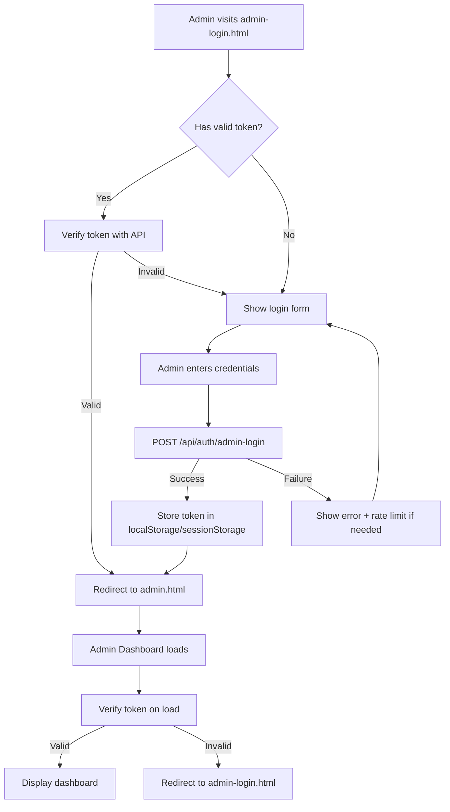

# Admin Login System - Setup Guide

## Overview

SmartInvest Africa now has a **separate admin authentication system** that is completely isolated from the regular user login. This ensures enhanced security and proper role-based access control.

## System Architecture

### 🔐 Two Separate Login Systems

1. **User Login** (`login.html`)
   - For regular platform users
   - Access to user dashboard, investments, and resources
   - Uses Supabase OAuth and email/password authentication

2. **Admin Login** (`admin-login.html`)
   - For platform administrators only
   - Access to admin dashboard, user management, and system controls
   - Uses custom JWT-based authentication with session management
   - Enhanced security features including rate limiting and audit logging

## Access Points

### From Homepage (index.html)

Users and admins can access the respective login pages from multiple locations:

1. **Navigation Bar**:
   - `Login` - Takes users to the user login page
   - `Admin` (in red) - Takes admins to the admin login page
   - `Sign Up` - For new user registration

2. **Footer**:
   - Under "Quick Links": User Login
   - Under "Administration": Admin Portal (marked with 🔐)

### From User Login Page

Users who mistakenly visit the user login page can find a link to the admin login at the bottom of the page.

### Direct URLs

- User Login: `https://yourdomain.com/login.html`
- Admin Login: `https://yourdomain.com/admin-login.html`
- Admin Dashboard: `https://yourdomain.com/admin.html`

## Admin Authentication Flow



## Security Features

### 1. Rate Limiting
- Maximum 5 failed login attempts per IP/email combination
- 15-minute lockout after exceeding limit
- Automatic reset after successful login

### 2. Session Management
- JWT-based authentication tokens
- Configurable session timeout (default: 1 hour)
- "Remember me" option for extended sessions (7 days)
- Automatic token validation on each admin page load

### 3. Audit Logging
- All login attempts logged with timestamps
- IP address tracking
- Success/failure status recorded
- Accessible via admin dashboard analytics

### 4. Protected Routes
- All admin pages check for valid token on load
- Automatic redirect to login if unauthorized
- Token verification with backend API

## Admin Configuration

### Location
`/config/admin-config.json`

### Default Admins

```json
{
  "adminUsers": [
    {
      "email": "delijah5415@gmail.com",
      "role": "super-admin",
      "permissions": [
        "user-management",
        "content-management",
        "analytics-view",
        "payment-oversight",
        "security-settings",
        "system-configuration"
      ],
      "status": "active"
    },
    {
      "email": "admin@smartinvest.com",
      "role": "admin",
      "permissions": [
        "user-management",
        "content-management",
        "analytics-view",
        "payment-oversight"
      ],
      "status": "active"
    }
  ]
}
```

### Adding New Admins

1. Edit `/config/admin-config.json`
2. Add a new admin user object to the `adminUsers` array
3. Set appropriate role and permissions
4. Ensure `status` is set to `"active"`
5. Save the file

### Roles

- **super-admin**: Full system access, including security settings and system configuration
- **admin**: Standard admin access without system configuration rights
- **moderator**: Limited access for content moderation (can be added as needed)

### Permissions

- `user-management`: Manage user accounts, grant/revoke access
- `content-management`: Edit site content, manage files
- `analytics-view`: View site analytics and reports
- `payment-oversight`: Monitor transactions and payments
- `security-settings`: Modify security configurations
- `system-configuration`: Change system-level settings

## API Endpoints

### Authentication

#### POST `/api/auth/admin-login`
Login with admin credentials

**Request:**
```json
{
  "email": "admin@smartinvest.com",
  "password": "your-password",
  "remember": false
}
```

**Response (Success):**
```json
{
  "success": true,
  "message": "Login successful",
  "token": "abc123...",
  "redirectUrl": "admin.html",
  "user": {
    "email": "admin@smartinvest.com",
    "role": "admin",
    "permissions": ["user-management", "content-management"]
  },
  "expiresAt": "2026-02-01T12:00:00Z"
}
```

**Response (Failure):**
```json
{
  "success": false,
  "error": "Invalid credentials"
}
```

#### POST `/api/auth/verify-admin`
Verify admin token validity

**Request:**
```json
{
  "token": "abc123..."
}
```

Or with Authorization header:
```
Authorization: Bearer abc123...
```

**Response:**
```json
{
  "success": true,
  "user": {
    "email": "admin@smartinvest.com",
    "role": "admin",
    "permissions": ["user-management", "content-management"]
  }
}
```

#### POST `/api/auth/admin-logout`
Invalidate admin session

**Request:**
```json
{
  "token": "abc123..."
}
```

**Response:**
```json
{
  "success": true
}
```

### Audit & Monitoring

#### GET `/api/auth/admin-audit-log`
Retrieve admin activity logs

**Headers:**
```
Authorization: Bearer abc123...
```

**Query Parameters:**
- `limit` (optional): Number of events to retrieve (default: 100)

**Response:**
```json
{
  "success": true,
  "events": [
    {
      "timestamp": "2026-02-01T10:30:00Z",
      "email": "admin@smartinvest.com",
      "action": "admin-login",
      "success": true,
      "details": {
        "ip": "192.168.1.1",
        "role": "admin"
      }
    }
  ]
}
```

## Frontend Implementation

### Storing Tokens

```javascript
// On successful login
if (remember) {
  localStorage.setItem('adminToken', data.token);
  localStorage.setItem('adminEmail', email);
} else {
  sessionStorage.setItem('adminToken', data.token);
  sessionStorage.setItem('adminEmail', email);
}
```

### Protected Page Template

```javascript
// At the top of any admin page
(function() {
  const adminToken = localStorage.getItem('adminToken') || 
                     sessionStorage.getItem('adminToken');
  
  if (!adminToken) {
    window.location.href = 'admin-login.html';
    return;
  }

  fetch('/api/auth/verify-admin', {
    method: 'POST',
    headers: {
      'Content-Type': 'application/json',
      'Authorization': `Bearer ${adminToken}`
    },
    body: JSON.stringify({ token: adminToken })
  })
  .then(res => res.json())
  .then(data => {
    if (!data.success) {
      alert('Your session has expired. Please login again.');
      window.location.href = 'admin-login.html';
    }
  });
})();
```

### Logout

```javascript
function adminLogout() {
  const adminToken = localStorage.getItem('adminToken') || 
                     sessionStorage.getItem('adminToken');
  
  fetch('/api/auth/admin-logout', {
    method: 'POST',
    headers: { 'Content-Type': 'application/json' },
    body: JSON.stringify({ token: adminToken })
  })
  .then(() => {
    localStorage.removeItem('adminToken');
    sessionStorage.removeItem('adminToken');
    window.location.href = 'admin-login.html';
  });
}
```

## Testing

### Test Admin Login

1. Visit `http://localhost:3000/admin-login.html` (or your domain)
2. Enter admin credentials:
   - Email: `admin@smartinvest.com` or `delijah5415@gmail.com`
   - Password: Any password with 6+ characters (demo mode)
3. Click "Access Admin Dashboard"
4. Should redirect to `admin.html` with authenticated session

### Test Protection

1. Try to access `admin.html` directly without logging in
2. Should be redirected to `admin-login.html`
3. After login, try refreshing admin page
4. Should stay authenticated

### Test Logout

1. Click "Logout" button in admin header
2. Should be redirected to `admin-login.html`
3. Try to access admin pages
4. Should require re-authentication

## Production Deployment Checklist

- [ ] Update admin emails in `/config/admin-config.json`
- [ ] Implement proper password hashing (bcrypt) in `/api/admin-auth.js`
- [ ] Set secure session timeout values
- [ ] Enable HTTPS for all admin pages
- [ ] Configure CORS properly for API endpoints
- [ ] Set up monitoring for failed login attempts
- [ ] Regular audit log review process
- [ ] Backup admin configuration file
- [ ] Test all admin endpoints
- [ ] Document admin procedures for your team

## Troubleshooting

### Cannot Access Admin Dashboard

**Problem**: Redirected to login page immediately after logging in

**Solutions**:
1. Check browser console for errors
2. Verify API endpoint is running: `POST /api/auth/admin-login`
3. Check if token is being stored (DevTools > Application > Local Storage)
4. Verify admin email is in `/config/admin-config.json` with `status: "active"`

### Session Expires Too Quickly

**Problem**: Getting logged out frequently

**Solutions**:
1. Check `securitySettings.sessionTimeout` in admin config
2. Use "Remember me" checkbox at login
3. Increase timeout value in `/config/admin-config.json`

### Rate Limited / Account Locked

**Problem**: "Too many failed attempts" error

**Solutions**:
1. Wait 15 minutes for automatic unlock
2. Or manually clear `/data/login-attempts.json` (development only)
3. Verify correct credentials

### Cannot Login with Correct Credentials

**Problem**: "Invalid credentials" even with correct email/password

**Solutions**:
1. Verify email is exactly as listed in `/config/admin-config.json`
2. Check `status` is set to `"active"`, not `"inactive"` or `"suspended"`
3. Check server logs for authentication errors
4. Verify admin-auth.js API is mounted in server.js

## Support

For additional help or to report issues:
- Email: support@smartinvest.com
- Documentation: `/docs/ADMIN_DASHBOARD_GUIDE.md`
- Security Issues: security@smartinvest.com

---

**Last Updated**: February 1, 2026
**Version**: 2.0
